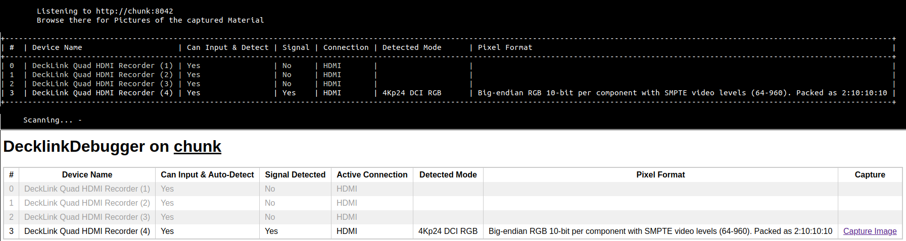

# Blackmagicdesign DeckLink Input-Debugger
**tl;dr** A tool to **probe all inputs** of all **Blackmagicdesign DeckLink cards** in a Linux system, detecting if a **signal is present** and which **image-format** it has, showing the results **on the terminal and via HTTP on port 8042**, allow **capturing still images**.



## Motivation
At c3voc we use Linux PCs with Blackmagicdesign DeckLink cards to capture video and audio. Often, during buildup of complex rooms like we have on 34C3 with multiple cameras, scalers, audio embedders and lots of other hardware in the signal path the question arrives if all is correctly connected up and delivers the correct signal-format.

Until now this required manually checking all inputs in all possible modes to see whether any signal is present and in which mode. At 34C3 the AV buildup crews connected everything up as they thought it should be, with no way to check if the signals actually arrived in software.

The software crew on the other hand had no tool to quickly check the setup and give feedback on possible problems, not knowing the state of buildup in the rooms.

This tool aims at giving the AV buildup crew a tool to self-service and check their cablings and camera-modes and a distinct way to communicate back to the software crew which modes are present on which inputs.

## Building
Prerequisites:
- Download and unpack the **Desktop Video** (library and kernel module) and the **Desktop Video SDK** (development files) packages from [https://www.blackmagicdesign.com/support/family/capture-and-playback](https://www.blackmagicdesign.com/support/family/capture-and-playback)
- Rename the unpacked SDK directory to something that has no whitespace in it.

```
# install Blackmagic libraries
sudo dpkg -i $HOME/VOC/Blackmagic_Desktop_Video_Linux_10.9.9/deb/x86_64/desktopvideo_10.9.9a4_amd64.deb
# install build dependencies
sudo apt-get install libmicrohttpd-dev libpng-dev cmake make gcc g++
# clone Git repository
git clone http://c3voc.de/git/decklink-debugger.git
cd decklink-debugger
# create build directory
# you can then start over by removing and recreating this directory
mkdir build
cd build
# specify path to Blackmagic SDK (optional parameter)
cmake .. -DDECKLINK_INCLUDE_DIR=~/VOC/Blackmagic-DeckLink-SDK-10.9.9/Linux/include/
# compile application
make -j$(nproc)
```

## Using
To check the status of all DeckLink inputs just start `decklink-debugger` on the system. No other program may use any of the cards or the debugger will not start. After starting it will continuously scan all cards for a signal. For cards with multiple connections (like the MiniRecorder cards which do SDI and HDMI) every second the next connection will be selected. The debugger currently supports HDMI, SDI and optical SDI. The Information on the terminal is refreshed every second.

In addition to the table printed to the terminal, a webserver on port 8042 will be started which also servers a table, refreshing every second. Furthermore in the Web UI a png-capture of the current frame can be viewed.

## Contact us
Hop over to `#voc-lounge` on `hackint.eu` (IRC) or drop us a line [on twitter](https://twitter.com/c3voc).
